  

  

    <b>Python engineer - scientific tooling and desktop apps</b> 
    Building XRF spectroscopy analysis at <a href="https://ircsan.com/" target="_blank">CSAN</a>
  

  

    
    
    
    
  

## Tech

  
  
  
  
  

   

  
  
  
  
  

   

  
  
  
  
  

## GitHub

  
  

  

